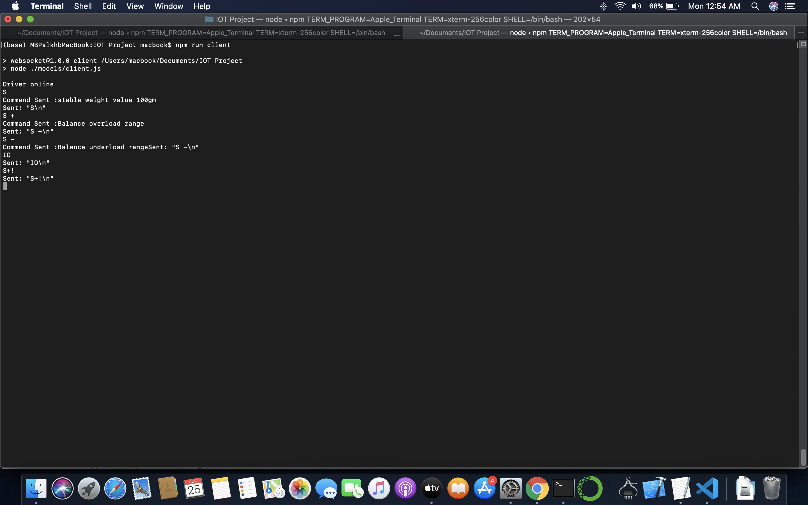

  

# Instructions

this is a lab assisgment presented to labforward team , the objective to establish a communication bet 2 devices to transfer data bet them.

## Brief 
the Idea of the solution is work on the device (Instrument) as a server and  driver ( machine ) as a client , using websockets as a realtime communication protocol which would be extremely fast , the steps to run the 2 nodejs apps as follows :

The port Configured is 9899, to change it please edit in the .env file 

* npm install
* npm run test
* npm run server ( On a terminal 1 ) or npm start 
* npm run client ( On a terminal 2 )
* start sending messages from terminal 2 and you should see it in terminal 1 , once message is sent a message would be sent to terminal 2 confirming that the message have been recieved. 

### Allowed commands in driver 
* S + 
* S -
* S 
* S I
* Send stable weight value'

sample

please contact me through email incase of any comments : aliahmedalihassan@gmail.com
#### Ali Nada 
